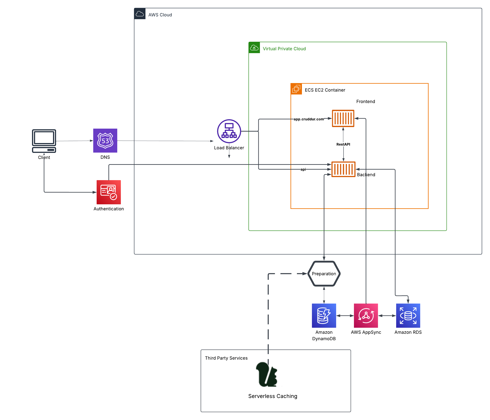

# AWS Cruddur Architecture

## Overview

This diagram represents the cloud architecture designed for the
Cruddur application.

## Architecture Diagram

## Key Components

- Client
- DNS
- Authentication
- Load balancer
- Frontend
- Backend
- Storage 
- Serverless casching 
